<picture>
  <source media="(prefers-color-scheme: dark)" srcset="https://raw.githubusercontent.com/ArulG2005/ArulG2005/output/github-contribution-grid-snake-dark.svg">
  <source media="(prefers-color-scheme: light)" srcset="https://raw.githubusercontent.com/ArulG2005/ArulG2005/output/github-contribution-grid-snake.svg">
  
</picture>

<div align="center">
  <a href="https://github.com/ArulG2005">
    
  </a>
</div>


<p align="center"> <a href="https://git.io/typing-svg">  </a> </p>
<p align="center">
  
  
  
</p>

<div align="center">
  
  &nbsp;
  <b>A few things about me:</b>
  &nbsp;
  
</div>

<br/>

<div align="center">
  <table>
    <tr>
      <td>🔭</td>
      <td>Currently working on <b>various exciting projects</b></td>
    </tr>
    <tr>
      <td>🎓</td>
      <td>Pursuing <b>B.Tech in Information Technology</b></td>
    </tr>
    <tr>
      <td>👯</td>
      <td>Looking to <b>collaborate on innovative projects</b></td>
    </tr>
    <tr>
      <td>💡</td>
      <td>Love <b>contributing ideas & learning new things</b></td>
    </tr>
    <tr>
      <td>😄</td>
      <td>Pronouns: <b>He/His</b></td>
    </tr>
    <tr>
      <td></td>
      <td><b><i>EXTREMELY EXTREMELY shy</i></b> 🙈🙈🙈 by nature... <br/>but my code does ALL the talking! 💻✨</td>
    </tr>
  </table>
</div>

<br/>

<p align="center">
  
</p>

<p align="center">
  
  
  
</p>


##  Connect With Me 

<p align="center">
  <a href="https://arulg.tech">
    
  </a>
  <a href="https://linkedin.com/in/arul2005">
    
  </a>
  <a href="https://play.google.com/store/apps/dev?id=7152012900864371035&hl=en_IN">
    
  </a>
  <a href="https://www.instagram.com/mr.aruleyy">
    
  </a>
</p>

<p align="center">
  
  
  
</p>


<h1 align="center">
  
  Tech Stack & Arsenal
  
</h1>

<p align="center">
  
</p>

<br/>

<details open>
<summary> <b>Programming Languages</b></summary>
<br/>
<p align="center">
  <a href="https://skillicons.dev">
    
  </a>
</p>
</details>

<details open>
<summary> <b>Frameworks & Libraries</b></summary>
<br/>
<p align="center">
  <a href="https://skillicons.dev">
    
  </a>
</p>
</details>

<details open>
<summary> <b>Backend, APIs & Cloud</b></summary>
<br/>
<p align="center">
  <a href="https://skillicons.dev">
    
  </a>
</p>
<p align="center">
  
  
  
  
  
</p>
</details>

<details open>
<summary> <b>Frontend & UI</b></summary>
<br/>
<p align="center">
  <a href="https://skillicons.dev">
    
  </a>
</p>
</details>

<details open>
<summary> <b>Databases</b></summary>
<br/>
<p align="center">
  <a href="https://skillicons.dev">
    
  </a>
</p>
</details>

<details open>
<summary> <b>Tools & IDEs</b></summary>
<br/>
<p align="center">
  <a href="https://skillicons.dev">
    
  </a>
</p>
</details>


<h1 align="center">
  
  Achievements
  
</h1>

<p align="center">
  
<p align="center">
  <a href="https://github.com/ryo-ma/github-profile-trophy">
    
  </a>
</p>

</p>

<p align="center">
  
  
  
</p>


<h1 align="center">
  
  GitHub Stats
  
</h1>

<p align="center">
  
</p>

<p align="center">
  
</p>

<p align="center">
  
  
</p>

<p align="center">
  
</p>

<p align="center">
  
</p>

<p align="center">
  
</p>


<h2 align="center">
  
  What I Do
  
</h2>

<p align="center">
  
</p>

<div align="center">

```javascript
const arul = {
    title: "Software Development Engineer",
    focus: ["Scalable Backend Systems", "Clean APIs", "High-Performance Apps"],
    expertise: ["System Design", "Distributed Systems", "Products Built to Scale"],
    currentStatus: "Building awesome things! 🚀",
    motto: "Let the code speak for itself ✨"
};
```

</div>

<br/>

<p align="center">
  
</p>

<p align="center">
  
</p>


<p align="center">
  
</p>

<p align="center">
  
</p>

<p align="center">
  
</p>

<p align="center">
  <a href="https://git.io/typing-svg">
    
  </a>
</p>

<p align="center">
   
  <em><b>I love</b> connecting with fellow developers!</em>
  
</p>

<br/>

<p align="center">
  
  
  
</p>

<p align="center">
  
</p>

<p align="center">
  
  
  
</p>
